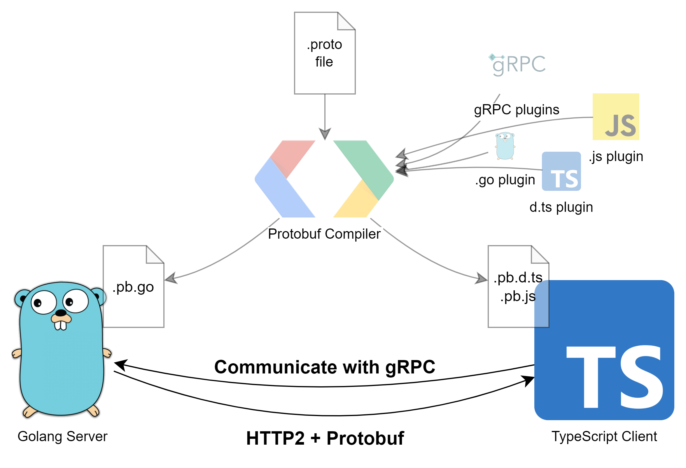
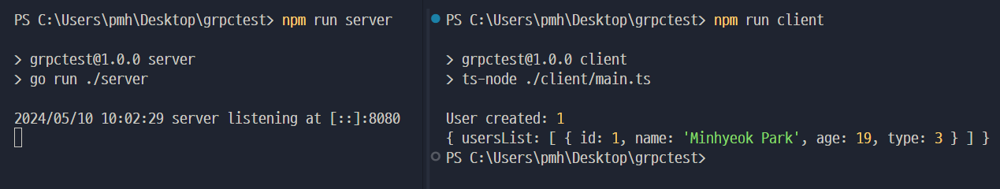
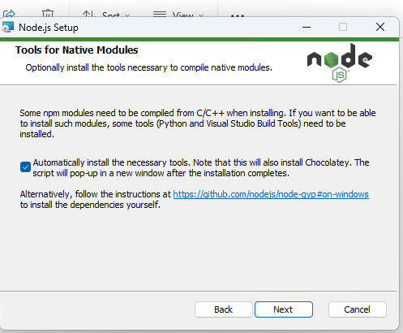

# grpctest
Simple gRPC application with cross-language communication (incl. golang server, typescript client and proto files) for educational purpose

](./docs/diagram.png)

## Screenshots
](./docs/image.png)

## Highlights
* [.proto File](./proto/users.proto)
* [Server Code](./server/main.go) (Golang)
* [Client Code](./client/main.ts) (TypeScript)

## Prerequirements
* golang compiler
* node.js runtime
* npm package manager
* [protobuf compiler](https://github.com/protocolbuffers/protobuf/releases)
* [protobuf js/js-grpc compiler](https://github.com/protocolbuffers/protobuf-javascript/releases)
* [protobuf go/go-grpc compiler](https://grpc.io/docs/languages/go/quickstart/#prerequisites)
* [And the node-gyp must work perfectly](https://github.com/nodejs/node-gyp#installation)
  > For Windows users: Just turn on this checkbox at node.js installation!
  > ](./docs/windows-gyp.png)

## How to run
* install every item of [prerequirements](#prerequirements).
* install golang dependencies: `go mod download`
* install nodejs dependencies: `npm i`
* generate gRPC-compiled codes: `npx buf generate ./proto`
* start server: `npm run server`
* Run client: `npm run client`
* *profit*

## Copyright
&copy; 2024. Minhyeok Park. MIT Licensed. see [LICENSE](./LICENSE) file
